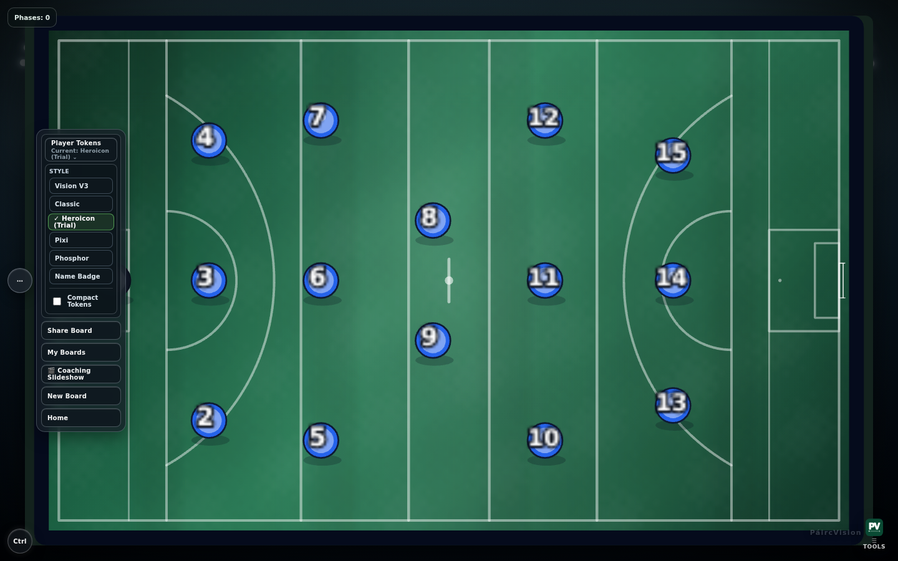
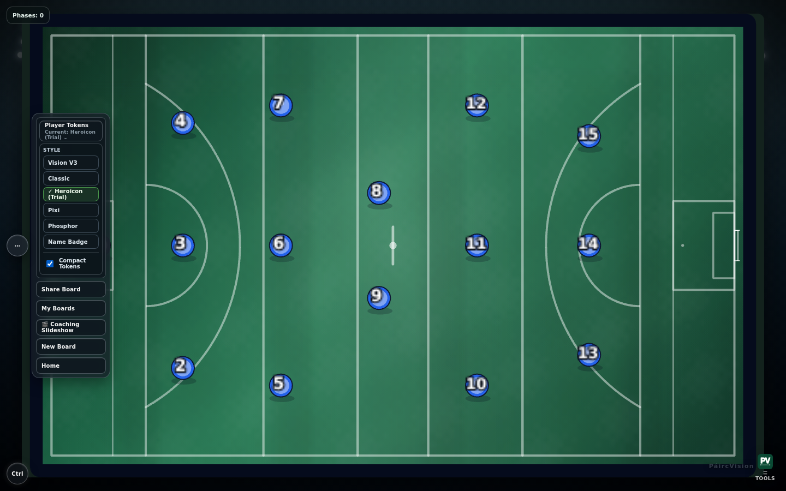
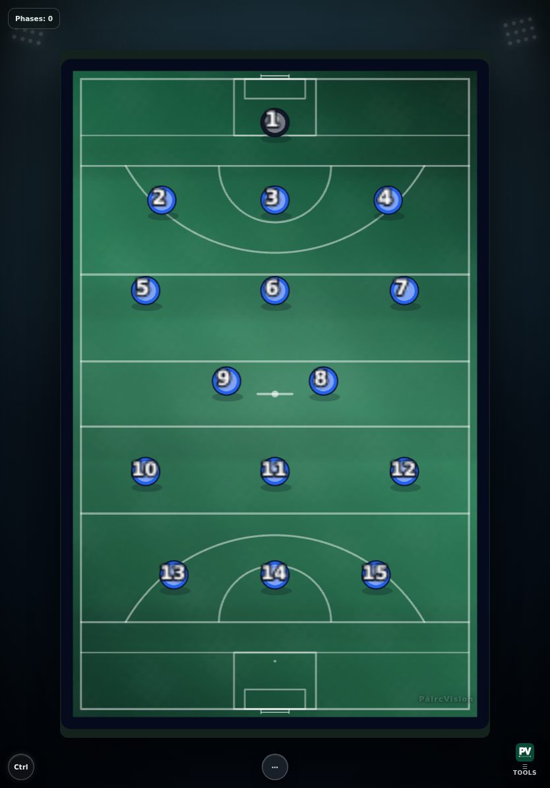
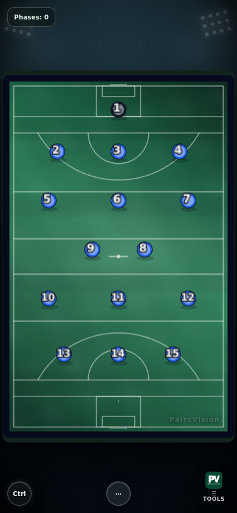
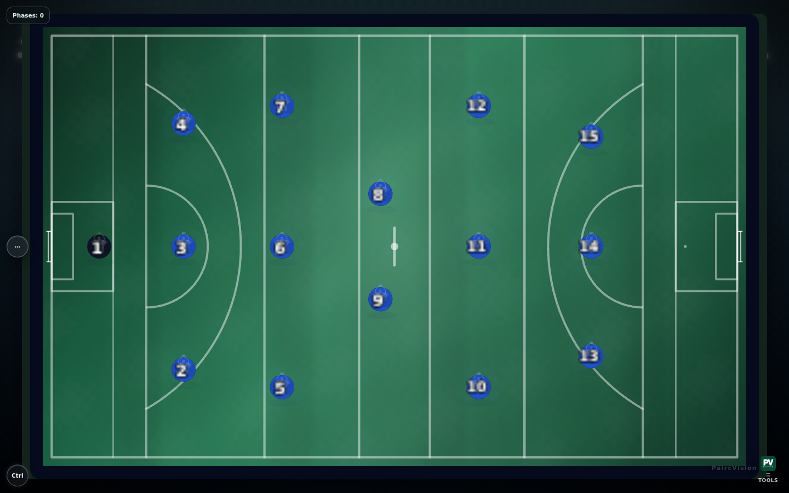
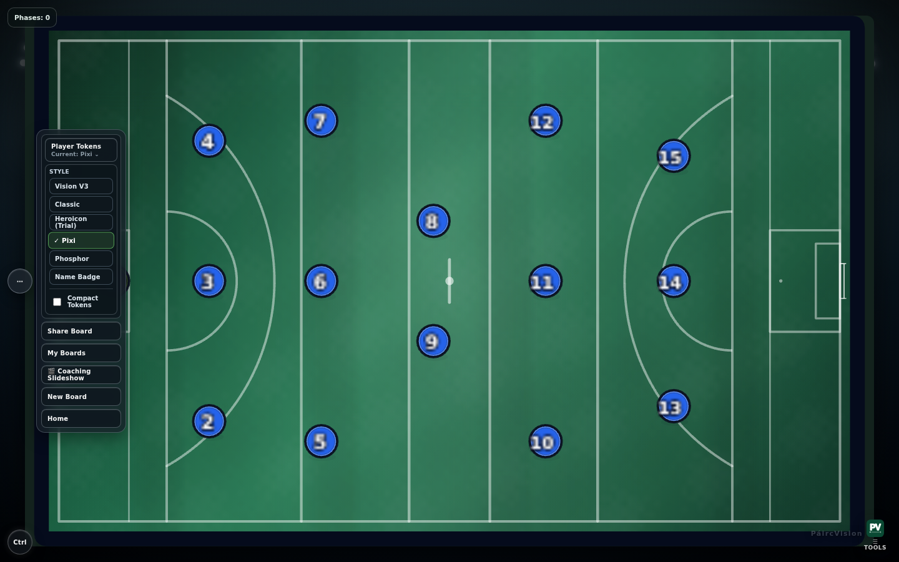
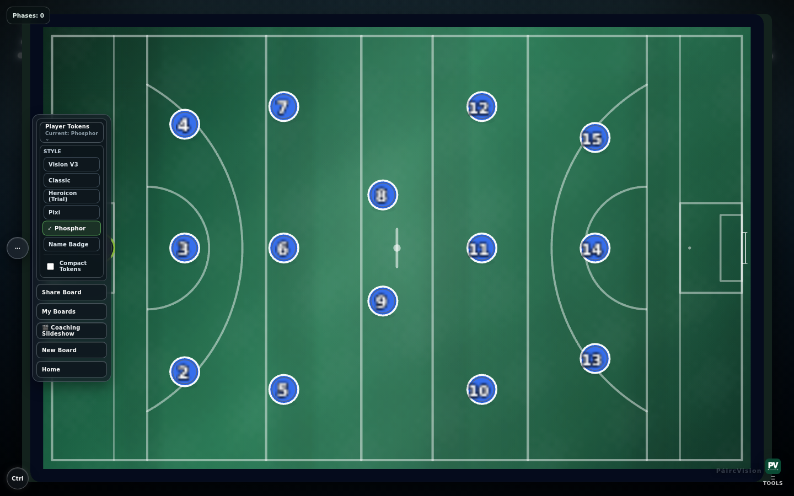
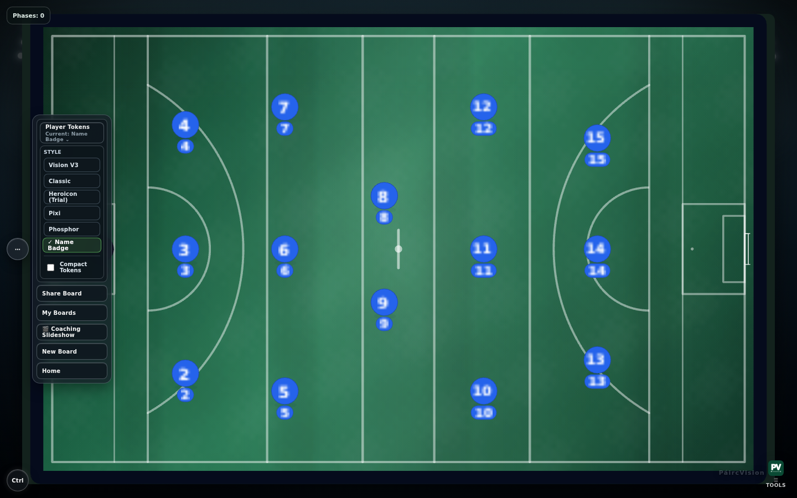

# Heroicon Token Evaluation

Isolated visual experiment: replace the "Glow" player-token style with a
prototype built from the Heroicons "user-circle" (solid) pictogram, to
evaluate it as a candidate replacement. Branch: `feature/heroicons-token-evaluation`.

No other token style (Vision V3, Classic, Pixi, Phosphor, Name Badge) was
touched, and no default token selection changed — "Vision V3" remains the
app default. Tactical Slate (whiteboard mode) does not use this renderer
at all and is confirmed unaffected below.

## Files changed

| File | Change |
|---|---|
| `src/engine/pixi/createHeroiconUserCircleToken.ts` | **New.** Self-contained renderer: team-tinted disc, Heroicons "user-circle" silhouette watermark, jersey number/label. Same `{label, teamColor, style, scale, kitPattern, kitPatternColor} → {token, shadow}` contract as every other token renderer. |
| `src/engine/pixi/playerTokenRenderer.ts` | Added `HeroiconUserCircleRenderer` (wraps the new file) and pointed `resolvePlayerTokenRenderer`'s `"premium"` case at it instead of `PremiumGlowRenderer`. `PremiumGlowRenderer` itself is untouched and still exported — see **Reverting** below. |
| `src/pages/TacticalPadLiteClean.tsx` | One label change: the `"premium"` entry in `TOKEN_STYLE_CHOICES` reads `"Heroicon (Trial)"` instead of `"Glow"`, so testers aren't shown a stale name for a different visual. The stored value (`"premium"`) is unchanged, so existing saved boards keep working. |

No other files were modified. `dist/` and `node_modules/` artifacts touched
during local build/test validation are not part of the diff.

## Heroicons version and license

- **Icon:** `user-circle`, solid style, 24×24 viewbox
- **Package version:** `2.2.0` (`package.json` `"version"` field, read directly from the repo)
- **Source (pinned, verified in-session):** https://github.com/tailwindlabs/heroicons/blob/v2.2.0/optimized/24/solid/user-circle.svg
- **License (verified in-session against the repo's own file, MIT):** https://github.com/tailwindlabs/heroicons/blob/v2.2.0/LICENSE
- Downloaded **only** from `raw.githubusercontent.com/tailwindlabs/heroicons` — no third-party mirror — and diffed identical between `master` and the `v2.2.0` tag before use, so the pinned reference is exact.
- MIT permits commercial use, modification, and closed-source bundling. The only obligation is keeping the copyright/permission notice with the software (satisfied by an internal third-party-notices file; no on-screen attribution required). The path data is embedded directly in `createHeroiconUserCircleToken.ts` with a comment pointing back to the pinned source.

## A bug found and fixed during validation

Pixi's `Graphics.svg()` throws (`Cannot read properties of null (reading
'querySelectorAll')`) if given a bare `<path>` fragment instead of a full
`<svg>` document — the doc example in Pixi's own type definitions is
misleading on this point. First attempt crashed the whole tactical board
(black screen, React error boundary triggered) the moment "Heroicon" was
selected. Fixed by wrapping the path in a proper
`<svg xmlns="..." width="24" height="24" viewBox="0 0 24 24">` element.
Confirmed fixed both by console-error capture and by the crops below.

## Validation performed

- **Typecheck:** `npm run typecheck` — clean.
- **Build:** `tsc -b` surfaces one pre-existing, unrelated failure
  (`gaa-goal-markings.test.ts` / `TextSpec.strokeWidth`) that reproduces
  identically on unmodified `origin/main` (confirmed via `git stash`) — not
  caused by this change. The actual bundler step, `vite build`, succeeds
  cleanly with these changes.
- **Tests:** `vitest run` — **756/756 passing across 51 files**, no
  regressions. (This environment's `node_modules` was missing `vitest`,
  `jspdf`, and `vite-plugin-pwa` at session start; installed them
  read-only via `npm install --no-save` to actually run the suite rather
  than assume it would pass.)
- **Live browser testing** (headless Chromium via Playwright, dev server):
  - Desktop (1440×900), tablet (834×1194), phone (390×844) viewports.
  - Direct A/B against Pixi, Phosphor, and Name Badge — all three render
    exactly as before (screenshots 04–06); Heroicon is additive, not
    disruptive.
  - Compact Tokens (small size) toggle — icon and number scale down
    together with the rest of the token (screenshot 07), since the icon is
    a child of the same `Container` every other element scales with.
  - Tactical Slate (`/whiteboard` route) — confirmed **not** on this code
    path at all (`createTokenPackForPlayer` only calls
    `resolvePlayerTokenRenderer` when `surfaceVariant === "tactical"`;
    whiteboard mode always uses the separate, untouched
    `createPremiumPlayerToken`). Screenshot 10 confirms the board is
    pixel-for-pixel the standard look.
  - PNG export (`Share Board → Snapshot`, `exportBoardSetupAsPng`) —
    triggered live; produced a valid ~1MB PNG blob with the Heroicon
    tokens rendered on it, no export-specific errors. This path extracts
    the live Pixi canvas generically — it has no per-style logic to
    diverge for a new renderer.
  - PDF export (`reviewPdfExport.ts`) — grepped for any reference to
    `resolvePlayerTokenRenderer` / `PlayerTokenStyle` / this renderer:
    **zero matches**. Match-report PDF export is a fully separate code
    path (shot/possession markers, not player tokens) and cannot be
    affected by this change.
  - Large/zoomed sizes — the icon is real vector path data driven through
    Pixi's native SVG parser, not a rasterized sprite, so it scales
    losslessly at any zoom the existing renderer already supports.

## Before / after

**Glow (before)** — dark backing plate, glow-ring halo, number in white on
near-black:

**Heroicon (after)** — flat team-tinted disc, faint user-circle silhouette
watermark, number in white with a dark stroke directly on the team colour:

Full board, default size:

Compact Tokens (small size):

Tablet / phone:

Tactical Slate, unaffected:

Comparators — Pixi, Phosphor, Name Badge (all rendering exactly as before):

## Assessment: is it genuinely clearer than Glow?

**Mixed, not a clean win — recommend a follow-up iteration before promoting
it to a permanent style.**

- **Where Heroicon wins:** it adds a real, low-cost identity cue Glow
  doesn't have — a silhouette that reads as "this is a player" even with
  colour removed (greyscale print, colour-blind viewing), which a flat
  dot or a pure glow-ring cannot do. It's also architecturally lighter:
  no halo rings, one verified MIT-licensed path, trivially recolourable
  via the existing team palette.
- **Where Glow wins:** raw number contrast. Glow gives every jersey number
  a dedicated near-black backing plate (`TOKEN_BASE_COLOR = 0x191919`),
  which puts white text at roughly 19:1 contrast regardless of team
  colour. Heroicon's number sits directly on the team-colour disc — for a
  mid-brightness colour like blue that's closer to 3:1 before the stroke
  outline helps. It is very likely still readable at 18–28px (per the
  earlier licensing-audit's rubric, stroke outlines recover most of that
  gap), but it is not a strict legibility upgrade the way the pictogram
  silhouette is a strict upgrade over a plain dot.
- **Recommendation:** don't promote this prototype to the default "Glow"
  replacement as-is. The cheapest next step, if this direction continues,
  is giving the Heroicon token a small dark number-plate behind the digits
  (the one piece of Glow's design that's doing real legibility work),
  while keeping the lighter silhouette-watermark approach for everything
  else. That would combine Glow's proven number contrast with Heroicon's
  print-safe identity cue, instead of trading one for the other.

## Reverting

If the Heroicon trial doesn't pan out, this is a one-file, one-line
change: in `src/engine/pixi/playerTokenRenderer.ts`, change
`resolvePlayerTokenRenderer`'s `"premium"` branch back to
`return PremiumGlowRenderer;` (it's still defined and exported, unused,
directly above `HeroiconUserCircleRenderer`). Optionally revert the label
in `TacticalPadLiteClean.tsx` back to `"Glow"`. `createHeroiconUserCircleToken.ts`
can be deleted or left in place — nothing else references it.
